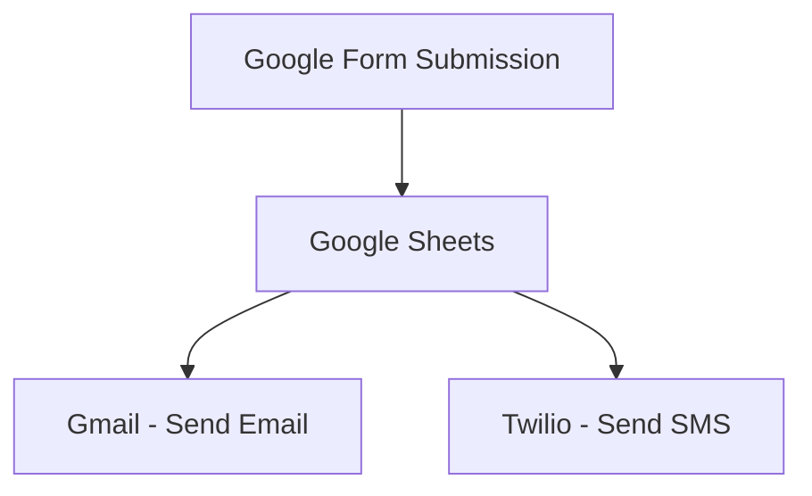

#  Zapier Automation System

## 📌 Overview

This project demonstrates an end-to-end automation workflow using Zapier. It integrates multiple services to automate user registration, data storage, and real-time notifications without any manual intervention.

The system captures user input from a Google Form and automatically triggers actions such as storing data, sending emails, and sending SMS notifications.

---

##  Workflow Diagram

---

## 🔄 Workflow Explanation

1. User fills out the Google Form
2. Data is automatically stored in Google Sheets
3. Zapier detects a new row (Trigger)
4. Gmail sends a confirmation email to the user
5. Twilio sends an SMS notification to the user

---

## 🛠️ Tools & Technologies Used

* Zapier (Automation Platform)
* Google Forms (Data Collection)
* Google Sheets (Data Storage)
* Gmail (Email Notification)
* Twilio (SMS Notification)

---

##  Key Features

*  Real-time automation
*  Dynamic email notifications
*  SMS alerts using Twilio
*  No-code workflow integration
*  Automated data collection

---

## 📸 Screenshots

### 🔹 Zapier Workflow

### 🔹 Email Automation

### 🔹 SMS Automation

### 🔹 Google Form

---

##  How It Works

* Zapier listens for new entries in Google Sheets
* When a new entry is detected:

  * It sends a personalized email
  * It sends an SMS to the user
* The entire process runs automatically

---

##  Use Cases

* Student Registration Systems
* Event Registration Automation
* Lead Management Systems
* Notification Systems
* Customer Onboarding

---

##  Outcome

This project successfully eliminates manual work by automating the entire workflow, ensuring fast, reliable, and real-time communication with users.

---

##  Learning Outcome

* Learned workflow automation concepts
* Hands-on experience with Zapier
* Integration of multiple services
* Real-time event-driven systems

---

## 👨‍💻 Author

**Ambrish Jeyan**

